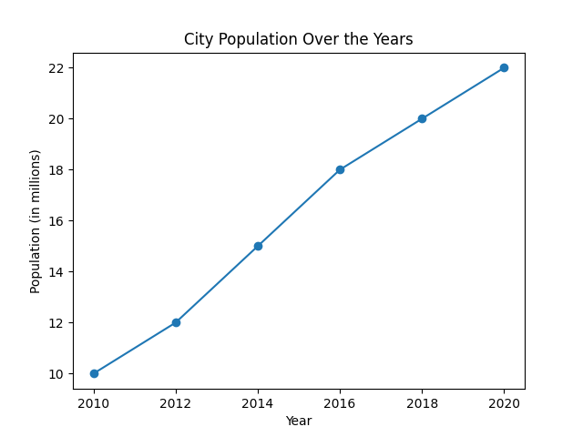

This Python script visualizes a city's population growth over six years.

Data for years (2010-2020) and corresponding population (in millions) are stored in lists.
Matplotlib library is used to create a line plot with markers for each data point.
The chart includes labels for x-axis (Year), y-axis (Population in millions), and a title ('City Population Over the Years').

